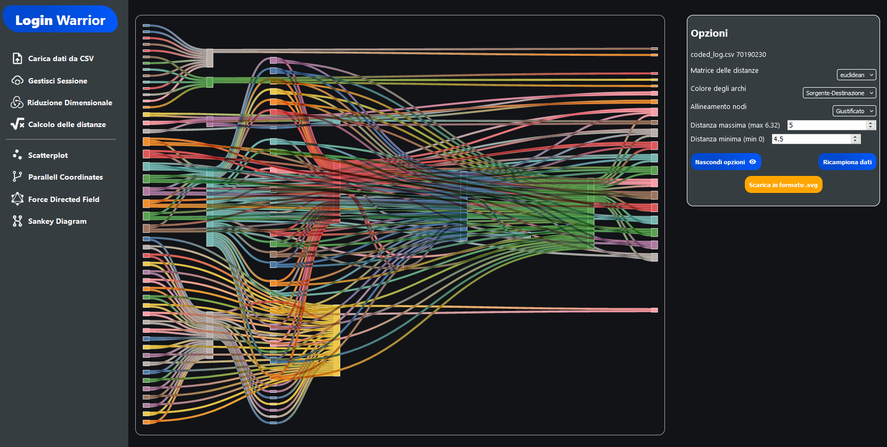

# LoginWarrior
React application to plot different type of charts.  
The application is reachable [here](https://codesixswe.github.io/).

## Feature
* Different type of chart to plot - Scatterplot, ForceDirected Field, Parallel Coordinates and Sankey Diagram
* Dimensional Reduction using T-SNE or UMAP algorithms
* Distance Matrices calculation
* Load data in _.csv_ file format
* Save and resume session

## Screenshot
#### Scatterplot

#### ForceDirected Field

#### Parallel Coordinates

#### Sankey Diagram

